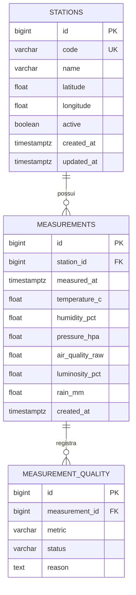

# DER técnico inicial

O modelo inicial mantém a estação, a medição e a qualidade de cada métrica em entidades separadas. Os timestamps são armazenados como `TIMESTAMPTZ`, seguindo a política de armazenar UTC e converter somente na apresentação.

## Restrições iniciais

`stations.code` identifica a estação de forma única. Toda medição pertence a uma estação existente. O índice principal de série temporal é composto por `station_id` e `measured_at`.

A tabela `measurement_quality` registra o estado por métrica e impede duas linhas para a mesma métrica da mesma medição. Os estados permitidos são `ok`, `suspect`, `invalid` e `error`.

A migration não define faixas físicas, fatores de conversão, calibração ou coordenadas reais. Esses itens permanecem dependentes de decisões e evidências ainda não disponíveis.
